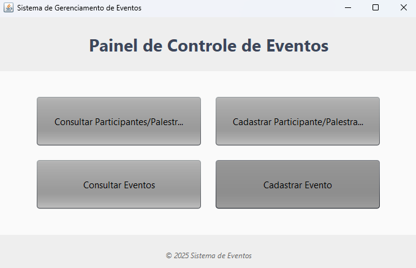
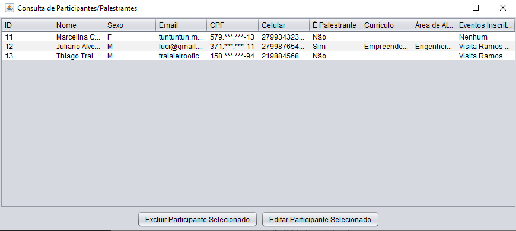
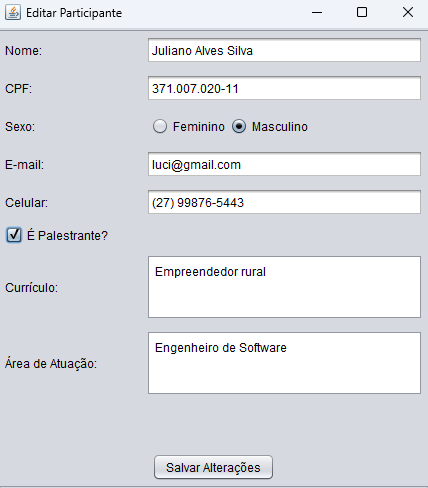
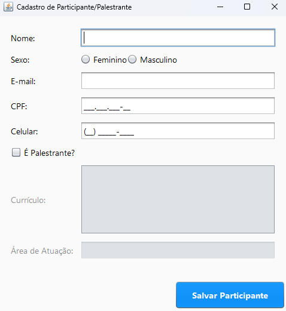
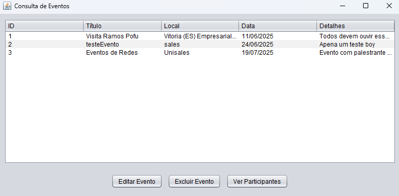
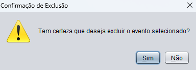
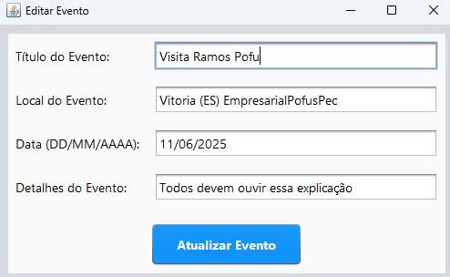
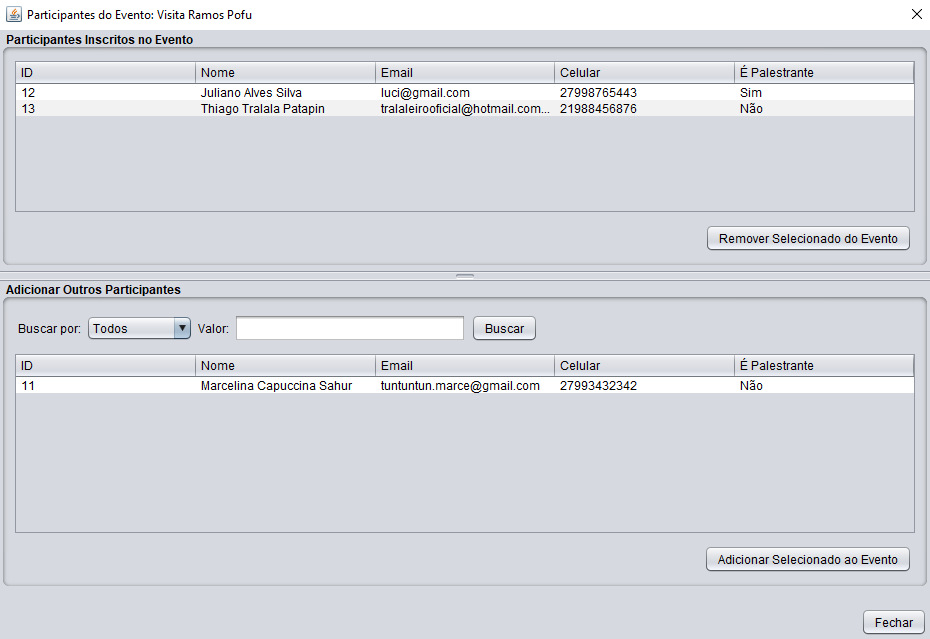
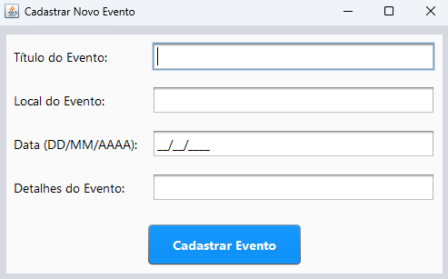

# Sistema de Gerenciamento de Eventos

Este sistema permite gerenciar **participantes** e **eventos** de forma simples, utilizando Java com Swing e SQLite.

<strong>📄 Guia Rápido: <spam style="font-size: 10px; font-color: red">Deprecated</spam></strong>

## 🎯 Funcionalidades

- Cadastro de participantes
- Consulta e exclusão de participantes
- Cadastro de eventos
- Consulta e exclusão de eventos

---

## 🖥️ Telas do Sistema

### `HomeFrame`
Tela principal do sistema com acesso às funcionalidades:
- Cadastrar participante
- Consultar participantes
- Consultar eventos

---

### `CadastroFrame`
Formulário para cadastro de participantes. Campos:
- Nome
- Sexo (F ou M)
- Email
- Celular
- Palestrante (S ou N)

---

### `ConsultaFrame`
Tela para visualizar e consultar os participantes cadastrados.
- Permite buscar por nome, sexo e email.
- Possui botão para **excluir participante selecionado**.

---

### `CadastroEventoFrame`
Formulário para cadastro de eventos. Campos:
- Título
- Local
- DataEvento
- Detalhes

---

### `ConsultaEventosFrame`
Tela para visualizar e consultar eventos cadastrados.
- Lista todos os eventos registrados.
- Possui botão para **excluir evento selecionado**.

---

## 🗃️ Banco de Dados

- **Banco: SQLite**
- Tabelas:
  - `participante` (id, nome, sexo, email, celular, ePalestrante)
  - `evento` (id, titulo, local)

---

📖 Manual

## Inicio

> Ao iniciar a palicação ela ira disponibilizar quatro opções:

- [Consultar Participante/Palestrante](#consultar-participantepalestrante)
- [Cadastrar Participante/Palestrante](#cadastrar-participantepalestrante)
- [Consultar Eventos]()
- [Cadastrar Eventos]()

> Essas opções possuem ligações diretas a manipulação ao banco de dados.

## Consultar Participante/Palestrante

> Aqui conseguimos ver os participantes e palestrantes já cadastrados, e você vera tambem duas opções, uma para escluir o qual estiver selecionado ou editar

### Editar/Excluir

> Ao tentar editar ou excluir voce vai ter que selecionar alguem, mas se voce for editar você vai se deparar a essa tela para realizar as alterações qeu serão salvas assim que confirmadas pressionando o botão.

---

## Cadastrar Participante/Palestrante

> Nessa opção de realizar o cadastro de um participante ou palastrante se diferencia pelo checkbox `É palastrante` que deve ser marcado somente se o cadastrado for participante e assim vai liberar mais dois campos para peenchimento

---

## Consultar Eventos

> O consultar eventos vai mostrar os eventos disponiveis já cadastrados e três opções para serem realizadas, como "[excluir](#excluir), [editar](#editar) e [ver participantes](#ver-participantes)"

### Excluir

> Selecione e exclua passando pelas confirmações para deletar

### Editar

> Após selecionar o evento e clicar em editar você ira ver uma nova janela para editar as informações do evento

### Ver Participantes

> Voce pode selecioar os participantes e palestrantes tanto da tabela de cima que ja estão registrados para o evento que tinha sido selecionado para remover ou usar a tabela de baixo para adicionar ao evento selecionado anteriormente.

---

## Cadastro Evento

> Você vai ver campos como o titulo, lucal, data e o detalhe para preencher, não se esqueça de ir no `cunsultar eventos` para atribuir os participantes e palestrantes

## 📺 Apresentação

- [Slide de apresentação](https://www.canva.com/design/DAGmJuozI_E/Q9yAGJSLwwTNtMrLV7lahg/view?utm_content=DAGmJuozI_E&utm_campaign=designshare&utm_medium=link2&utm_source=uniquelinks&utlId=hbab1ada0e1)

---

## 🧑‍💻 Contribuidores

- [@Dspofu](https://github.com/Dspofu)
- [@SammyKunimatsu](https://github.com/SammyKunimatsu)
- [@PedroCoelho04](https://github.com/pedrocoelho04)
